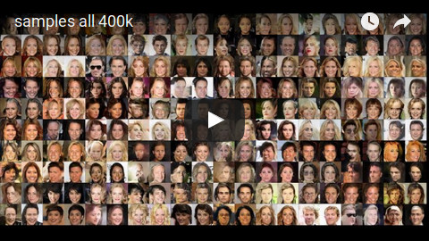
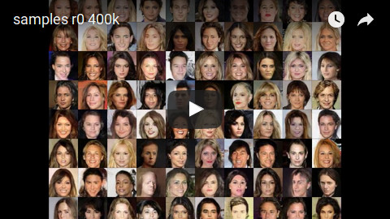
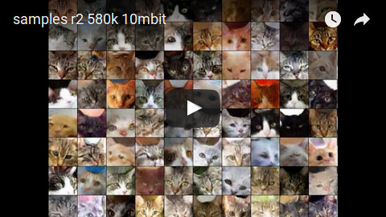

# About

This repository contains code for the paper [(1707.00768) Learning to Avoid Errors in GANs by Manipulating Input Spaces](https://arxiv.org/abs/1707.00768).
The basic idea of the paper is to distort the input space (i.e. the noise vectors) in a way that the image quality is improved.
More intuitively, the generator is trained to understand its own weaknesses and allowed to simply evade input vectors that would result in bad quality -- though it is punished whenever it does that.
The paper introduces LIS modules, which consist of residual fully connected layers and are placed at the beginning of the generator.
These modules manipulate the input vectors and thereby reduce the frequency of image artifacts (especially the frequency of completely broken images).
They are almost free with regards to computation/memory.
Image diversity is mostly unaffected by them.

The code in this repository is based on the one from the paper "On the Effects of Batch and Weight Normalization in Generative Adversarial Networks" (see [repository](https://github.com/stormraiser/GAN-weight-norm)).
The command line arguments are largely similar or the same.


# Images

G-LIS with 1 LIS module, trained on CelebA (300k batches):


G-LIS with 3 LIS modules, trained on CelebA (300k batches):


G-LIS with 1 LIS module at 160x160, trained on CelebA (570k batches):


G-LIS with 3 LIS modules, trained on 120flowers (600k batches):


G-LIS with 1 LIS module, trained on 10kcats (600k batches, 3 layers instead of 4 in G and D, NN-upsampling, dropout before last layer in D):


Example interpolation, same model as before:


G-LIS with 1 LIS module, trained on LSUN churches (500k batches):


G-LIS with 3 LIS modules (with 2 of 3 modules executed for this image), trained on CIFAR-10 (1M batches):


R-iterative, images showing progressive improvements per iteration (trained on CelebA, 130k batches):


R-separate correcting artifacts, before/after applying the model (2.5k batches for R, spatial dropout at 10%):


# Training Videos

Training on CelebA at 160x160 with one LIS module. This seems to produce more errors than 80x80 with one module.
The video shows faces generated from the original noise vectors (each left) and the same noise vectors after they were manipulated by the LIS module.

[](http://www.youtube.com/watch?v=SkC76XoYOrs)


Same training as above, but this time only the second image of each pair is shown (i.e. only with applied LIS module).

[](http://www.youtube.com/watch?v=gT71geKc-cY)


Similar to the previous video, but training was done on the 10kcats datasets at 64x64 with 3 LIS modules (showing the results of the last module).
Note that this is not the exactly same model as for the images above. The eyes seem to have less artifacts here.
This model used one more layer in G and D as well as two more LIS modules.
One of these factors likely resulted in less structural artifacts.
Due to aggressive cropping the training images ended up looking a bit blurry.

[](http://www.youtube.com/watch?v=16PP68-onwQ)


# Dependencies

* python2.7 (some uses of xrange in the code)
* pytorch at commit 065c59860a8bb5a01634bb0ce9eff6647ae1f342. At some later commit (don't know exactly which one), the weight normalization modules start to raise errors due to some internal pytorch change.
* numpy, scipy
* imgaug (can be commented out if no augmentation is used)
* matplotlib
* seaborn (only required for plotting scripts)
* scikit-learn (only required for plotting scripts)

# Usage

The below commands are optimized for CelebA. Download that dataset and extract it to a directory, e.g. `/path/to/datasets/celeba`.
Then split it into train and test:
```bash
python common/split_data.py --dataset folder --dataroot /path/to/datasets/celeba --running 1 --final 1
```

## R-iterative

In order to train R-iterative, saving checkpoints to e.g. `/path/to/checkpoints/exp01` (where `exp01` is here the name of the experiment).
```bash
python r_iterative/main.py --dataset folder --dataroot /path/to/datasets/celeba --crop_size 160 --image_size 80 --code_size 256 --norm weight --lr 0.00005 --niter 300000 --save_path /path/to/checkpoints/exp01
```
That command trains at `80x80` resolution (`--image_size`) and learning rate `0.00005` (`--lr`) for `300,000` batches (`--niter`).
After the initial run of G, it executes `3` iterations of R+G (`--r_iterations`) with lambda\_R (strength of similarity constraint) of `0.9` (changeable via `--lambda_r`).
If you have to stop the experiment for some time, you can continue it by simply appending `--load_path /path/to/checkpoints/exp01` at the end of the command (do not delete `--save_path`).
By default, a checkpoint is saved every 2000 batches (`--save_interval`).

In order to sample images from G+R use
```bash
python r_iterative/sample_images.py --image_size 80 --code_size 256 --norm weight --r_iterations 3 --load_path_g /path/to/checkpoints/exp01/net_archive/last_gen.pt --load_path_r /path/to/checkpoints/exp01/net_archive/last_r.pt --save_path /path/to/outputs/exp01/final_sampled_images
```
This loads the last G and R from experiment `exp01` and saves images to directory `/path/to/outputs/exp01/`.
Note that the various arguments (e.g. `--image_size`, `--r_iterations`, ...) must match the ones that were used during the training.

## G-LIS (G with LIS modules)

Then run the training, saving checkpoints to e.g. `/path/to/checkpoints/exp01` (where `exp01` is here the name of the experiment).
```bash
python g_lis/main.py --dataset folder --dataroot /path/to/datasets/celeba --crop_size 160 --image_size 80 --code_size 256 --norm weight --lr 0.00002 --r_iterations 1 --niter 300000 --save_path /path/to/checkpoints/exp01
```
That command trains at `80x80` resolution (`--image_size`) and learning rate `0.00002` (`--lr`) for `300,000` batches (`--niter`).
It uses `1` LIS module (`--r_iterations`) with lambda\_R (strength of similarity constraint) of `0.9` (changeable via `--lambda_r`).
If you have to stop the experiment for some time, you can continue it by simply appending `--load_path /path/to/checkpoints/exp01` at the end of the command (do not delete `--save_path`).
By default, a checkpoint is saved every 5000 batches (`--save_interval`).

In order to sample images from the trained generator use
```bash
python g_lis/sample_images.py --image_size 80 --code_size 256 --norm weight --r_iterations 1 --load_path_g /path/to/checkpoints/exp01/net_archive/last_gen.pt --save_path /path/to/outputs/exp01/sampled_images/
```
This loads the last generator from experiment `exp01` and saves images to directory `/path/to/outputs/exp01/sampled_images/`.
Note that the various arguments (e.g. `--image_size`, `--r_iterations`, ...) must match the ones that were used during the training.
The main subdirectories in `sampled_images/` that you will care about are likely `sampled_images_rX`, where `X` starts at 0 (original noise vectors) and goes up to the value of `--r_iterations` (noise vectors of the last LIS module).

In order to create t-SNE plots of the noise vectors before/after LIS modules use
```bash
python g_lis/sample_tsne.py --image_size 80 --code_size 256 --norm weight --r_iterations 1 --load_path_g /path/to/checkpoints/exp01/net_archive/last_gen.pt --save_path /path/to/outputs/exp01/tsne/
```
The plots will be saved to `/path/to/outputs/exp01/tsne/`. Note that this also caches the embedded vectors. Rerunning the command with the same `--save_path` will load the cached points instead of re-embedding them.

In order to create probability distribution plots for the noise vector components before/after LIS modules use
```bash
python g_lis/sample_density.py --image_size 80 --code_size 256 --norm weight --r_iterations 1 --load_path_g /path/to/checkpoints/exp01/net_archive/last_gen.pt --save_path /path/to/checkpoints/exp01/density/
```
The plots will be saved to `/path/to/outputs/exp01/density/`.

In order to calculate Inception Scores (requires `tensorflow`) use
```bash
python g_lis/calculate_inception_scores.py --dataset folder --dataroot /path/to/datasets/celeba --crop_size 160 --image_size 80 --code_size 256 --norm weight --r_iterations 3 --inception_images 50000 --load_path /path/to/checkpoints/exp01
```
This will produce a lot of output, run for ages and requires significant amounts of RAM. Files that contain inception scores will be written to `/path/to/checkpoints/exp01`.

The below commands are roughly the ones that were used to train on CIFAR-10, 102flowers and LSUN churches:
```bash
python g_lis/main.py --dataset cifar10 --dataroot /path/to/datasets/cifar-10 --crop_size 28 --image_size 32 --augment cifar10 --code_size 256 --norm weight --lr 0.00002 --r_iterations 3 --niter 1000000 --save_interval 25000 --vis_interval 1000 --nlayer 4 --nfeature 128 --lambda_r 0.9 --nb_cache_total 300000 --nb_cache_lists 5 --cache_p_drop 0.05 --save_path /path/to/checkpoints/exp-cifar #--load_path /path/to/checkpoints/exp-cifar
python g_lis/main.py --dataset folder --dataroot /path/to/datasets/102flowers --crop_size 450 --image_size 80 --augment flowers102 --code_size 256 --norm weight --lr 0.00002 --r_iterations 3 --niter 500000 --save_interval 20000 --vis_interval 5000 --nb_cache_total 30000 --nb_cache_lists 3 --cache_p_drop 0.1 --save_path /path/to/checkpoints/exp-120flowers #--load_path /path/to/checkpoints/exp-120flowers
python g_lis/main.py --dataset folder --dataroot /path/to/datasets/church_outdoor_train_80x80_square --crop_size 76 --image_size 80 --augment lsun_churches --code_size 256 --norm weight --lr 0.00002 --r_iterations 1 --niter 500000 --save_interval 20000 --vis_interval 5000 --save_path /save/to/checkpoints/exp-churches #--load_path /save/to/checkpoints/exp-churches
```
The directory `church_outdoor_train_80x80_square` contained the LSUN churches images, which were zero-padded to be squared and then resized to 80x80.

## R-separate

R-separate is integrated into G-LIS. First, train a G-LIS module according to the commands listed above.
Then train R-separate using
```bash
python g_lis/train_r.py --dataset folder --dataroot /path/to/datasets/celeba --crop_size 160 --image_size 80 --code_size 256 --norm weight --r_iterations 1 --lr 0.00005 --niter 2500 --spatial_dropout_r 0.1 --save_path_r /path/to/checkpoints/r-exp01 --load_path /path/to/checkpoints/exp01
```
This trains R-separate for 2500 batches with spatial dropout of 10%.
It is trained based on a G-LIS model which's checkpoints are saved to `/path/to/checkpoints/exp01`.
The checkpoints of R-separate are saved to `/path/to/checkpoints/r-exp01`.

Then sample images using
```bash
python g_lis/sample_images.py --image_size 80 --code_size 256 --norm weight --r_iterations 1 --spatial_dropout_r 0.1 --load_path_g /path/to/checkpoints/exp01/net_archive/last_gen.pt --load_path_r /path/to/checkpoints/r-exp01/net_archive/2500_r.pt --save_path /path/to/outputs/exp01/sampled_images_r/
```
This saves images to `/path/to/outputs/exp01/sampled_images_r/`.
